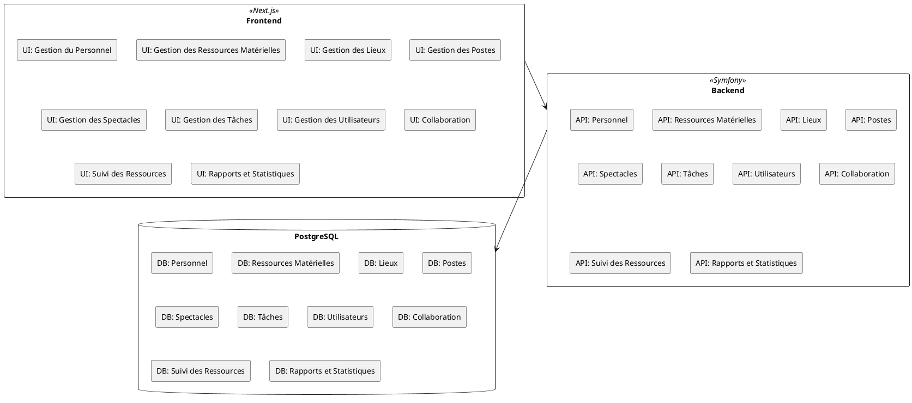

= SPEC-1: Système de Gestion Intégré pour une société de production de Spectacles
:sectnums:
:toc:

== Background

Ce projet vise à développer un système de gestion intégré pour une société de production de spectacles. Le système permettra de gérer plusieurs aspects opérationnels tels que la gestion du personnel, des ressources matérielles, des lieux de spectacles, des postes et fonctions, ainsi que la planification et l'organisation des spectacles. Il inclura également des fonctionnalités pour le suivi des tâches, la collaboration en temps réel, le suivi des ressources et la génération de rapports et statistiques.

Le backend sera développé en utilisant le framework Symfony, tandis que le frontend utilisera Next.js pour offrir une interface utilisateur réactive et moderne.

== Requirements

_Gestion du Personnel_:

- Ajouter, modifier, supprimer et consulter les informations des employés.
- Filtrer la liste du personnel.
- Exporter la liste du personnel en formats CSV et PDF.

_Gestion des Ressources Matérielles_:

- Ajouter, modifier, supprimer et consulter les ressources matérielles.
- Filtrer la liste des ressources matérielles.
- Exporter la liste des ressources matérielles en formats CSV et PDF.

_Gestion des Lieux_:

- Ajouter, modifier, supprimer et consulter les lieux de spectacles.
- Filtrer la liste des lieux.
- Exporter la liste des lieux en formats CSV et PDF.

_Gestion des Postes_:

- Ajouter, modifier, supprimer et consulter les postes et fonctions.
- Filtrer la liste des postes.
- Exporter la liste des postes en formats CSV et PDF.

_Gestion des Spectacles_:

- Ajouter, modifier, supprimer et consulter les spectacles.
- Filtrer la liste des spectacles.
- Exporter la liste des spectacles en formats CSV et PDF.
- Générer une fiche spectacle en PDF.

_Gestion des Tâches_:

- Créer, modifier, supprimer et consulter les tâches associées aux spectacles.
- Filtrer la liste des tâches.
- Exporter la liste des tâches en formats CSV et PDF.

_Gestion des Utilisateurs_:

- Ajouter, modifier, supprimer et attribuer des rôles aux utilisateurs.

_Collaboration en Temps Réel_:

- Utiliser la messagerie interne.
- Partager des documents.
- Ajouter des commentaires sur les tâches.

_Suivi des Ressources_:

- Suivre et planifier l'utilisation des ressources matérielles et humaines.

_Rapports et Statistiques_:

- Générer des rapports de performance.
- Consulter les statistiques d'avancement.
- Créer un tableau de bord personnalisé.

== Method

_Technologies utilisées_:

- Backend : Symfony
- Frontend : Next.js
- Base de données : PostgreSQL

_Architecture générale_:

- Le système sera basé sur une architecture RESTful pour permettre une communication efficace entre le frontend et le backend.
- Utilisation de JWT pour l'authentification et l'autorisation.
- Implémentation de tests unitaires et fonctionnels pour assurer la qualité du code.

Diagramme d'architecture :

== Implementation

- Configuration initiale des environnements de développement pour Symfony et Next.js.
- Création des modèles de données et des migrations pour la base de données PostgreSQL.
- Développement des endpoints API pour chaque fonctionnalité en utilisant Symfony.
- Développement des interfaces utilisateur avec Next.js en intégrant les appels API.
- Implémentation de l'authentification et de l'autorisation avec JWT.
- Tests unitaires et fonctionnels pour garantir la fiabilité du système.
- Déploiement sur un environnement de production.

== Milestones

- Initial Setup: Configuration des environnements et mise en place de la base de données.
- API Development: Développement des endpoints pour toutes les fonctionnalités principales.
- Frontend Development: Création des interfaces utilisateur et intégration avec les API.
- Authentication & Authorization: Implémentation de la sécurité avec JWT.
- Testing: Écriture et exécution des tests unitaires et fonctionnels.
- Deployment: Déploiement sur un environnement de production.
